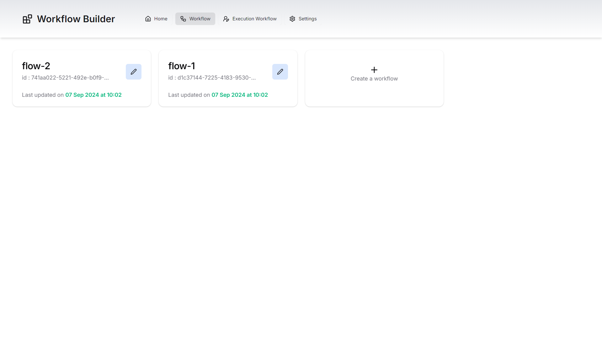
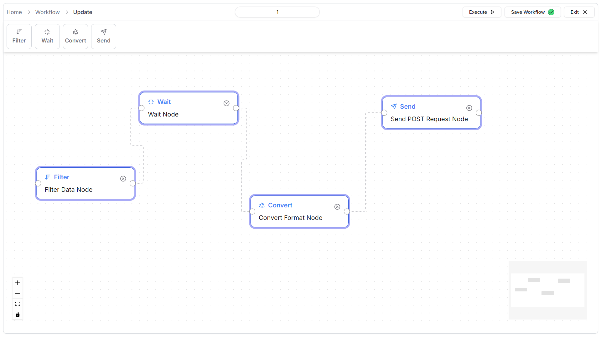

<div align="center">
  <h2 style="font-family: 'Georgia', serif; font-weight: bold; font-size: 2rem; color: #FFE5CA;" align="center">Workflow Builder</h2>
</div>


## 📚 Table of Contents

1. 🤖 [Introduction](#-introduction)
1. ✨ [Features](#-features)
2. 🧑‍💻 [Tech Stack](#-tech-stack)
3. 🔧 [Local Setup](#-local-setup)
7. 📄 [Feedback](#-feedback)
8. 📸 [Screenshots](#-screenshots)

<!-- 4. [📝 Contributing](#-contributing) -->
<!-- 5. [📄 License](#-license) -->
<!-- 6. [📬 Contact](#-contact) -->

## 🤖 Introduction

This project features creating, managing, and visualizing different types of nodes in a React application. It uses Zustand for state management and React Flow for interactive node connections. The project allows users to dynamically add, edit, and delete nodes, with a focus on flexibility and efficiency.

## ✨ Features

- **Dynamic Node Creation**: Add new nodes of various types easily by dragging and dropping
- **Interactive Connections**: Nodes can be connected with interactive edges to another node
- **Customizable Styles**: Nodes and handles can be styled and customized
- **Manage Workflow**: create, read and update workflows


## 🧑‍💻 Tech Stack


- ⚛️ [React](https://reactjs.org/): UI library for building user interfaces.
- ⬜ [Next.js](https://nextjs.org/): React framework for server-side rendering and static site generation.
- 💨 [Tailwind CSS](https://tailwindcss.com/): Utility-first CSS framework for rapid UI development.
- 💎 [Shadcn UI](https://shadcn.dev/): UI components for React with a focus on accessibility.
- <span style="background-color:#1e90ff;color:white;padding:1px 3px;border-radius:3px;font-size:0.7em;margin-left:3px;">TS</span> [TypeScript](https://www.typescriptlang.org/): Superset of JavaScript adding static types.
- 🔥 [ExpressJS](https://honojs.dev/): web framework for building APIs.
- 🛠️ [Zod](https://zod.dev/): Schema validation for TypeScript and JavaScript.
- 🐻 [Zustand](https://zustand-demo.pmnd.rs/): Lightweight state management for React.
- 🟪 [Prisma](https://www.prisma.io/): ORM for TypeScript and Node.js with a focus on type safety.
- 🌐 [Neon Database](https://neon.tech/): Serverless PostgreSQL database.
- 🐘 [PostgreSQL](https://www.postgresql.org/): Open-source relational database system.
- 🎣 [Tanstack React Query](https://react-query.tanstack.com/): Data fetching and synchronization for React.


## ⚙️ Local setup

1. Clone this repository:
    ```bash
    $ git clone https://github.com/Vinod-Mane3021/workflow-builder.git
    ```
2. Backend
      ```bash
      $ cd backend
      $ pnpm install 
      $ pnpm start
      ```

3. Frontend
    ```bash
    $ cd frontend
    $ pnpm install 
    $ pnpm run dev
    ```


## ****📄 Feedback****

I'd be happy to connect with you! <br>

<a href="https://www.linkedin.com/in/vinod-mane-a74817220/" target="_blank">
  
</a> 
<a href="https://x.com/VinodMane21" target="_blank">
  
</a>

## ****📄 Screenshots****

- 

- 

